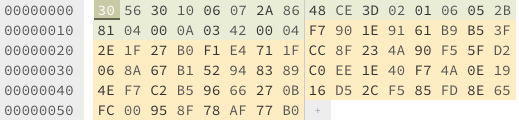

# Playing with ethereum secp256k1 keys

In this article, we will generate a `secp256k1` key with `openssl`, analyse the content of the public key `.pem` file and generate the [Ethereum address](https://ethereum.org/en/developers/docs/accounts/#account-creation) from it.

<!--truncate-->

## Generate keys with OpenSSL

Let's generate a private key using OpenSSL:

```sh
openssl ecparam -name secp256k1 -genkey -noout -out priv-key.pem
```

and create the corresponding public key:

```sh
openssl ec -in priv-key.pem -pubout > pub-key.pem
```

You can also generate this file:

```sh
openssl ec -in priv-key.pem -text -noout -out priv-pub-key
```

The `-noout` option prevents output of the encoded version of the request.

You should have a file like this:

```txt title="public-key.pem"
-----BEGIN PUBLIC KEY-----
MFYwEAYHKoZIzj0CAQYFK4EEAAoDQgAE95AekWG5tT8uHyew8eRxH8yPI0qQ9V/S
BopnsVKUg4nA7h5A90oOGU73wrWWZicLFtUs9YX9jmX8AJWPeK93sA==
-----END PUBLIC KEY-----
```

## From .pem to uncompressed hex public key

The content of the file above is encoded in `base64`, let's get our public key from it in hex.

```js
const pem =
  "-----BEGIN PUBLIC KEY-----\n" +
  "MFYwEAYHKoZIzj0CAQYFK4EEAAoDQgAE95AekWG5tT8uHyew8eRxH8yPI0qQ9V/S\n" +
  "BopnsVKUg4nA7h5A90oOGU73wrWWZicLFtUs9YX9jmX8AJWPeK93sA==\n" +
  "-----END PUBLIC KEY-----\n";

const b64Final = pem
  .replace(/\n/g, "")
  .replace("-----BEGIN PUBLIC KEY-----", "")
  .replace("-----END PUBLIC KEY-----", "");

console.log(b64Final);
// MFYwEAYHKoZIzj0CAQYFK4EEAAoDQgAE95AekWG5tT8uHyew8eRxH8yPI0qQ9V/SBopnsVKUg4nA7h5A90oOGU73wrWWZicLFtUs9YX9jmX8AJWPeK93sA==
```

According to [`RFC5480`](https://www.rfc-editor.org/rfc/rfc5480), the structure is:

```txt
SubjectPublicKeyInfo  ::=  SEQUENCE  {
    algorithm         AlgorithmIdentifier,
    subjectPublicKey  BIT STRING
}

AlgorithmIdentifier  ::=  SEQUENCE  {
    algorithm   OBJECT IDENTIFIER,
    parameters  ANY DEFINED BY algorithm OPTIONAL
}
```

In our case, the `AlgorithmIdentifier` is[^1], [^2]:

```
SEQUENCE { OID 1.2.840.10045.2.1 (ecPublicKey), OID 1.3.132.0.10 (secp256k1) }
```

Let's check the hex value of the key:

```js
const b64Final =
  "MFYwEAYHKoZIzj0CAQYFK4EEAAoDQgAE95AekWG5tT8uHyew8eRxH8yPI0qQ9V/SBopnsVKUg4nA7h5A90oOGU73wrWWZicLFtUs9YX9jmX8AJWPeK93sA==";

const buffer = Buffer.from(b64Final, "base64");
const pemHex = buffer.toString("hex");

console.log(pemHex);
// 3056301006072a8648ce3d020106052b8104000a03420004f7901e9161b9b53f2e1f27b0f1e4711fcc8f234a90f55fd2068a67b152948389c0ee1e40f74a0e194ef7c2b59666270b16d52cf585fd8e65fc00958f78af77b0
```

We can analyse this hexadecimal string in an [hexadecimal editor](https://hexed.it/):



In hexadecimal, each group of 2 characters represents one byte. The `algorithm` (AlgorithmIdentifier) is encoded in the first 24 bytes.
You can use an [Online Object Identifier DER Encoder](https://misc.daniel-marschall.de/asn.1/oid-converter/online.php) to find values above:

| Name        | OID               | HEX                          |
| ----------- | ----------------- | ---------------------------- |
| ecPublicKey | 1.2.840.10045.2.1 | `06 07 2A 86 48 CE 3D 02 01` |
| secp256k1   | 1.3.132.0.10      | `06 05 2B 81 04 00 0A`       |

The `subjectPublicKey` is encoded in the remaining 26 bytes.
To remove the first 24 bytes, we can remove the first `2*24` hexadecimal characters from the `pemHex` string above.

Finally, we need to add the `0x04` prefix (`0x` is for hexadecimal, [but why 04?](https://bitcointalk.org/index.php?topic=42384.0)) - `(0x04 | PubKeyX(32B) | PubKeyY(32B))` and we get the uncompressed public key:

```txt title="Uncompressed public key"
0x04f7901e9161b9b53f2e1f27b0f1e4711fcc8f234a90f55fd2068a67b152948389c0ee1e40f74a0e194ef7c2b59666270b16d52cf585fd8e65fc00958f78af77b0
```

You can check if the hex value above matches the `pub:` value you have in the `priv-pub-key` file generated earlier.

```txt
Private-Key: (256 bit)
priv:
    00:...
pub:
    04:f7:90:1e:91:61:b9:b5:3f:2e:1f:27:b0:f1:e4:
    71:1f:cc:8f:23:4a:90:f5:5f:d2:06:8a:67:b1:52:
    94:83:89:c0:ee:1e:40:f7:4a:0e:19:4e:f7:c2:b5:
    96:66:27:0b:16:d5:2c:f5:85:fd:8e:65:fc:00:95:
    8f:78:af:77:b0
ASN1 OID: secp256k1

```

## Uncompressed public key -> Ethereum address

So now, we have an uncompressed public key in hex, how to get the Ethereum address from it?

According to the Ethereum docs[^3]:

_The address consists of the rightmost 160 bits of the 256-bit Keccak-256 hash of the serialized public key. This is equivalent to the rightmost 20 bytes of the 32-byte hash._

In Ethereum we only use uncompressed key (`0x04` prefix).
Public key K (x and y coordinates concatenated and shown as hex):

```
f7901e9161b9b53f2e1f27b0f1e4711fcc8f234a90f55fd2068a67b152948389c0ee1e40f74a0e194ef7c2b59666270b16d52cf585fd8e65fc00958f78af77b0
```

It is worth noting that the public key is not formatted with the prefix (hex) 04 when the address is calculated.

You need to hash the _bytes_ of the public key (not the public key hex _string_).

```js
const pemHexWithoutHeader =
  "f7901e9161b9b53f2e1f27b0f1e4711fcc8f234a90f55fd2068a67b152948389c0ee1e40f74a0e194ef7c2b59666270b16d52cf585fd8e65fc00958f78af77b0";

const hash = createKeccakHash("keccak256")
  .update(Buffer.from(pemHexWithoutHeader, "hex"))
  .digest();
const address = "0x" + hash.slice(-20).toString("hex");

console.log("Checksum address:", web3.utils.toChecksumAddress(address));
// 0x039DC3795a6702F2B53FA0A29534Ec90B10F8d6a
```

Done :)

# References

- [^1][OID-Info - id-ecPublicKey](http://oid-info.com/get/1.2.840.10045.2.1)
- [^2][OID-Info - secp256k1](http://oid-info.com/get/1.3.132.0.10)
- [^3]<https://ethereum.org/en/developers/docs/accounts/#account-creation>
- <https://www.oreilly.com/library/view/mastering-ethereum/9781491971932/ch04.html>
- <https://tls.mbed.org/kb/cryptography/asn1-key-structures-in-der-and-pem>
- [SEC 1: Elliptic Curve Cryptography](https://www.secg.org/sec1-v2.pdf)
- <https://gist.github.com/miguelmota/3793b160992b4ea0b616497b8e5aee2f>
